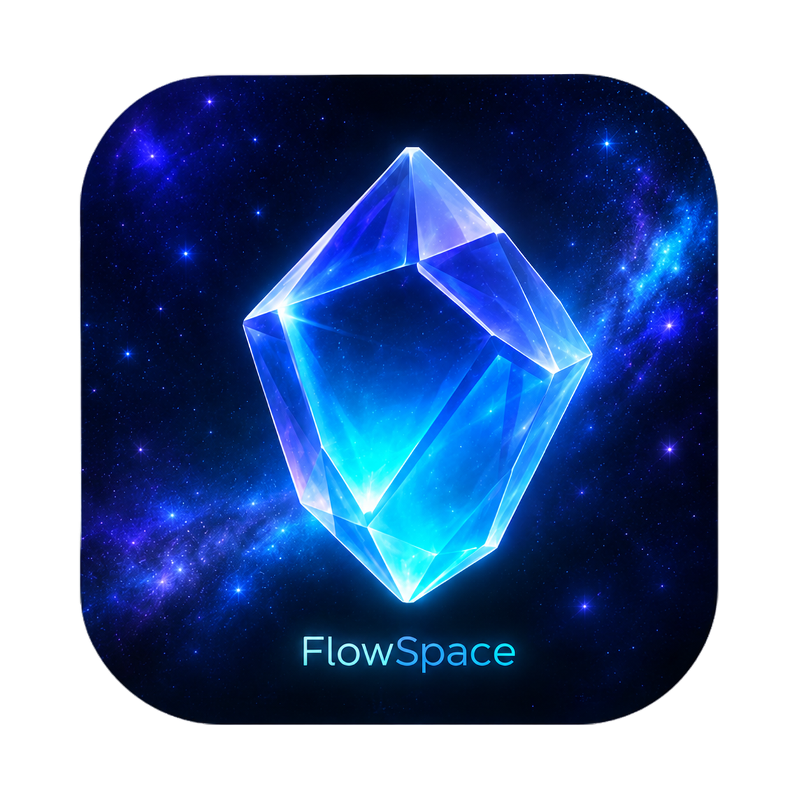

<p align="center">
  
</p>

<h1 align="center">FlowSpace</h1>

<p align="center">
  <strong>沉浸式生产力伴侣</strong><br/>
  将敲击动量转化为响应式视觉与自适应环境音频。
</p>

<p align="center">
  <a href="README.md">English</a> &nbsp;|&nbsp; 中文
</p>

<p align="center">
  
  
  
  
  
</p>

---

## FlowSpace 是什么？

FlowSpace 是一款桌面生产力工具，通过将你实时的打字强度转化为**动态 3D 视觉**和**自适应环境音频**，为你营造沉浸式专注氛围。它安静地运行在后台，全局监听键盘输入，在不打断心流的前提下，实时映射你的专注状态。

当你快速敲击键盘时，星空加速流转、泛光变强、音频滤波器打开；当你停下来，一切又缓缓沉降。

## 核心功能

- **实时心流能量** — Rust 后端全局监听键盘输入，通过 WPM 指数衰减算法计算心流能量值（0.0–1.0），每 100ms 推送到前端。
- **3D 星空视觉** — 基于 Three.js 和 UnrealBloomPass 构建。星点随能量值漂移、发光、变色。点击进入星海漫游模式，拖拽自由探索。
- **自适应环境音频** — 通过 Web Audio API 处理程序化噪声。截止频率和增益随打字能量动态变化。天气感知预设（雨 / 风 / 暴风雨）匹配真实环境。
- **多轨音频调音台** — 在三个分类（自然、雨声、动物）中叠加独立环境音轨。支持开关、音量调节和收藏。
- **智能天气集成** — 自动检测位置（IP + 设备地理定位），获取实时天气数据，选择对应的环境音频画像。支持自定义天气覆盖（如「东京」「雷暴」）。
- **外接歌单嵌入** — 支持网易云音乐、QQ 音乐、Apple Music、酷狗音乐的 iframe 歌单嵌入。
- **macOS 权限向导** — 逐步引导用户授予「辅助功能」和「输入监控」权限，支持实时状态检测和一键跳转系统设置。
- **渲染生命周期管理** — 窗口失焦或隐藏时自动暂停渲染，节省 GPU 资源。

## 技术栈

| 层级          | 技术                                                         |
| :----------- | :----------------------------------------------------------- |
| 桌面壳        | [Tauri v2](https://tauri.app/)                               |
| 后端          | Rust（`device_query`、`reqwest`、`tokio`、`parking_lot`、`core-foundation`） |
| 前端          | TypeScript、Vite                                             |
| 3D 渲染       | [Three.js](https://threejs.org/) + EffectComposer + UnrealBloomPass |
| 音频          | Web Audio API（程序化噪声合成、BiquadFilter、GainNode）        |
| 样式          | 手写 CSS（无框架），玻璃拟态 + 暗色主题                        |
| 天气 API      | [Open-Meteo](https://open-meteo.com/)（免费，无需 API Key）    |
| 地理定位      | [ipapi.co](https://ipapi.co/) + 浏览器 Geolocation API        |

## 快速开始

### 前置条件

- **Rust**（通过 [rustup](https://rustup.rs/) 安装）
- **Node.js** >= 18
- **macOS**（当前主要目标平台；Windows/Linux 支持取决于 Tauri 和 `device_query` 的兼容性）
- **macOS 权限**：FlowSpace 需要「辅助功能」和「输入监控」权限才能进行全局键盘监听。首次启动时应用会引导你完成授权。

### 开发

```bash
# 克隆仓库
git clone https://github.com/your-org/FlowSpace.git
cd FlowSpace

# 安装前端依赖
npm install

# 启动 Tauri 开发服务器
npm run tauri dev
```

首次启动后你会看到欢迎星空画面。按提示授予 macOS 所需权限，然后点击星空进入工作空间。

### 构建

```bash
npm run tauri build
```

打包后的 `.app` 位于 `src-tauri/target/release/bundle/`。

## 架构

```
┌──────────────────────────────────────────────────────┐
│                    Tauri 桌面壳                        │
├──────────────────────┬───────────────────────────────┤
│     Rust 后端         │     TypeScript 前端             │
│                        │                               │
│  ┌──────────────────┐ │  ┌─────────────────────────┐  │
│  │  键盘监听器        │ │  │  Three.js 星空场景       │  │
│  │  (device_query)   │ │  │  + UnrealBloomPass      │  │
│  └────────┬─────────┘ │  └─────────────────────────┘  │
│           │            │                               │
│  ┌────────▼─────────┐ │  ┌─────────────────────────┐  │
│  │  心流状态机        │ │  │  Web Audio 引擎          │  │
│  │  (WPM + 衰减)     │─┼─▶│  (程序化噪声 +            │  │
│  └────────┬─────────┘ │  │   能量响应滤波器)          │  │
│           │            │  └─────────────────────────┘  │
│  ┌────────▼─────────┐ │  ┌─────────────────────────┐  │
│  │  天气服务          │ │  │  音频调音台 UI           │  │
│  │  (Open-Meteo)    │─┼─▶│  (多轨、音量、收藏、分类)   │  │
│  └──────────────────┘ │  └─────────────────────────┘  │
│                        │                               │
│  ┌──────────────────┐ │  ┌─────────────────────────┐  │
│  │  权限管理器        │ │  │  设置面板                │  │
│  │  (macOS TCC)     │─┼─▶│  (音源、天气覆盖、歌单)    │  │
│  └──────────────────┘ │  └─────────────────────────┘  │
└────────────────────────┴───────────────────────────────┘
```

### 心流能量算法

1. 每一次键盘敲击都会被记录时间戳。
2. 每 100ms 一个 tick：统计过去 5 秒内的敲击次数。
3. **WPM** = `(敲击数 / 5) × (60 / 5)`（5 次敲击约等于 1 个单词）。
4. **原始能量** = `min(WPM / 120, 1.0)`（120 WPM 达到峰值）。
5. **衰减**：若没有新的敲击，能量值每 tick 乘以 **0.95**。
6. 最终结果通过 Tauri IPC 发送到前端。

## 项目结构

```
FlowSpace/
├── src/                          # 前端源码（TypeScript）
│   ├── main.ts                   # 入口、UI、事件处理、IPC
│   ├── audio/
│   │   └── AudioManager.ts       # Web Audio API 引擎
│   └── visual/
│       └── VisualManager.ts      # Three.js 星空场景
├── src-tauri/                    # Rust 后端
│   ├── Cargo.toml                # Rust 依赖
│   ├── tauri.conf.json           # Tauri 窗口与打包配置
│   └── src/
│       └── main.rs               # 心流状态机、键盘监听、
│                                 #   天气服务、macOS 权限
├── public/nature/                # 环境音频素材（*.mp3）
├── index.html                    # Vite 入口 HTML
├── package.json                  # Node 依赖与脚本
├── tsconfig.json                 # TypeScript 配置
└── vite.config.ts                # Vite 配置
```

## 权限说明

FlowSpace 需要两个 macOS 隐私权限才能监听全局键盘输入：

- **辅助功能** — 允许应用接收系统级键盘事件。
- **输入监控** — macOS 10.15+ 对键盘事件监听所需的额外权限。

应用内置权限引导横幅，会逐步指引你完成授权。你也可以手动在**系统设置 → 隐私与安全性**中开启。

未授权时，心流能量核心功能无法工作，但其他所有功能（视觉、音频调音台、天气、歌单）仍然可用。

## 开源协议

[MIT](LICENSE)

---

<p align="center">
  <sub>以 Rust、TypeScript 和「对的氛围能让深度工作自然发生」的信念构建。</sub>
</p>
